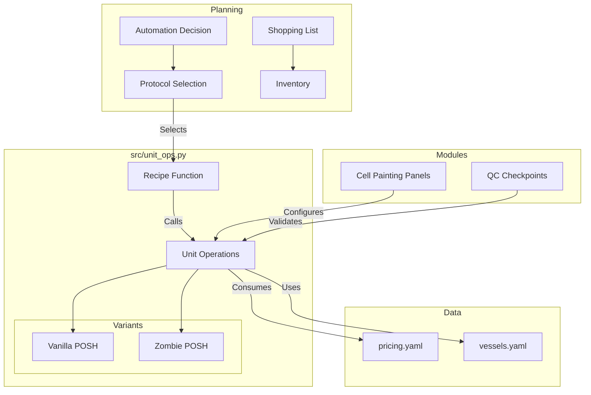

# POSH System Architecture

This document outlines the modular components that make up the **POSH (Perturb-seq / Optical Pooled Screening)** ecosystem in `cell_OS`.

## 1. Core Protocols (The "Engine")

The core logic resides in `src/unit_ops.py`. We have modeled two distinct variants of the protocol.

### A. Vanilla POSH (Legacy)
*   **Status**: Deprecated. Preserved for historical cost comparison and benchmarking.
*   **Mechanism**: Reverse Transcription (RT) → Gap Fill/Ligation → RCA → Sequencing.
*   **Key Operations**:
    *   `op_reverse_transcription`
    *   `op_gap_fill_ligation`
    *   `op_rolling_circle_amplification`
    *   `op_sbs_cycle` (Sequencing by Synthesis)
*   **Recipe**: `get_vanilla_posh_complete_recipe`

### B. Zombie POSH (Standard)
*   **Status**: Active. The default protocol for all new experiments.
*   **Mechanism**: Direct T7 In Vitro Transcription (IVT) from fixed gDNA.
*   **Key Operations**:
    *   `op_decross_linking` (Heat treatment)
    *   `op_t7_ivt` (Amplification)
    *   `op_hcr_fish` (Optional multimodal)
    *   `op_ibex_immunofluorescence` (Optional multimodal)
*   **Recipe**: `get_zombie_posh_complete_recipe`

## 2. Modular Cell Painting (The "Eyes")

A flexible system for defining imaging panels, located in `src/cellpaint_panels.py`.

*   **Panel Builder**: Allows mix-and-match of dyes and antibodies.
*   **Pre-defined Panels**:
    *   `Core CellPaint` (Standard 5-channel)
    *   `POSH CellPaint` (ISS-compatible, uses MitoProbe)
    *   `NeuroPaint` (Neuronal markers like MAP2)
    *   `HepatoPaint` (Lipid droplets)
    *   `ALSPaint` (Disease markers like TDP-43)
*   **Integration**: `op_cell_painting` in `unit_ops.py` now accepts these panel objects and automatically generates the correct liquid handling steps (e.g., adding secondary antibody steps only when needed).

## 3. Decision Support (The "Brain")

Tools to help plan experiments and manage costs.

*   **Automation Decision**: `src/posh_automation_decision.py`
    *   Analyzes throughput and budget to recommend Manual vs. Semi-Automated vs. Fully Automated workflows.
    *   Calculates NPV and Break-Even points.
*   **Shopping List Generator**: `src/zombie_posh_shopping_list.py`
    *   Generates a precise Bill of Materials (BOM) for Zombie POSH.
    *   Handles safety factors, multimodal options, and current inventory.
*   **QC Checkpoints**: `zombie_posh_qc_checkpoints.md`
    *   Defined pass/fail criteria for every stage.

## 4. Data & Resources (The "Fuel")

*   **Pricing Catalog**: `data/raw/pricing.yaml`
    *   Contains exact catalog numbers and prices for all specific reagents (T7 kits, specific antibodies, specialized plates).
*   **Vessel Library**: `data/raw/vessels.yaml`
    *   Defines labware (6-well plates, glass-bottom plates).

## System Map

