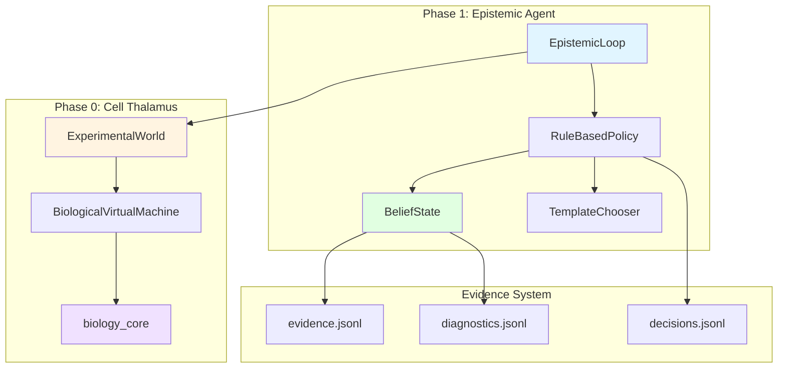

# cell_OS

**Autonomous Operating System for Cell Biology Research** 🧬

A production-ready platform for simulating and discovering optimal experimental conditions through autonomous active learning. Built on a deterministic, biologically-grounded world model (Cell Thalamus) with pay-for-calibration epistemic agents.

[]()
[]()

---

## 🚀 Quick Start

```bash
# Clone and install
git clone https://github.com/your-org/cell_OS.git
cd cell_OS
python -m venv venv
source venv/bin/activate  # On Windows: venv\Scripts\activate
pip install -e .

# Run the epistemic agent (Phase 1)
python scripts/run_epistemic_agent.py --cycles 10 --budget 200 --seed 42

# Launch the dashboard
streamlit run dashboard_app/app.py

# Run Cell Thalamus simulation (Phase 0)
python standalone_cell_thalamus.py --mode full --seed 0
```

---

## 📖 What is cell_OS?

cell_OS is a **research platform** for autonomous experimental design in cell biology, consisting of:

### 🧪 Cell Thalamus (Phase 0)
**Biologically-grounded world simulator** for cell-based assays
- Deterministic simulation of 2,304 wells (96-well plates × 24 replicates)
- Cell line-specific responses (A549, HepG2, iPSC neurons, iPSC microglia)
- 10 stress compounds (oxidative, ER, mitochondrial, DNA damage, proteasome, microtubule)
- Cell Painting morphology (5 channels: DNA, ER, Actin, Mitochondria, AGP)
- LDH cytotoxicity readout
- **Fixed sentinel scaffolding** for statistical process control
- **50-100× speedup** on JupyterHub (72 CPUs: ~5 minutes for full campaign)

### 🤖 Epistemic Agent (Phase 1)
**Active learning agent** that discovers optimal experimental conditions
- **Pay-for-calibration regime**: Must earn "noise gate" before biology experiments
- **Gate lock invariant**: Enforces calibration quality (rel_width ≤ 0.25)
- **Evidence ledgers**: Complete provenance tracking (JSONL receipts)
- **Observer-independent**: Physics-based attrition (no Schrödinger's cat)
- **Autonomous**: Proposes experiments, updates beliefs, manages budget
- **Deterministic**: Same seed → same results (cross-machine verified)

---

## 🏗️ Architecture



### Core Components

| Component | Purpose |
|-----------|---------|
| **Cell Thalamus** | Biologically-realistic simulation engine with morphology + viability |
| **Epistemic Agent** | Active learning agent with calibration requirements |
| **BeliefState** | Tracks what agent knows with evidence receipts |
| **TemplateChooser** | Decides next experiment (baseline, edge test, dose ladder) |
| **Hardware Abstraction** | Switch between virtual and real lab execution |
| **Evidence Ledgers** | JSONL logs for complete provenance |

---

## ✨ Key Features

### 🔬 Biological Realism (Cell Thalamus)
- **Cell line-specific sensitivity**: iPSC neurons resist microtubule drugs, cancer cells die
- **Morphology-first principle**: Transport disruption → attrition → death (72-96h timeline)
- **Observer independence**: Cell fate identical whether you measure or not
- **IC50 coupling**: Proliferation-dependent sensitivity (mitotic catastrophe)
- **Attrition feedback**: Morphology disruption scales death rate
- **Death accounting**: Track instant vs cumulative death separately

### 🧠 Epistemic Guarantees (Phase 1 v0.4.2)
- **Pay-for-calibration**: Biology experiments forbidden until noise gate earned
- **Gate criteria**: Pooled variance CI width ≤ 25% of estimate (rel_width ≤ 0.25)
- **Hysteresis control**: enter_threshold=0.25, exit_threshold=0.40 (prevent flapping)
- **Drift detection**: Compare recent vs historical noise estimates
- **Fail-fast**: Abort if insufficient budget to earn gate
- **Symmetric receipts**: Both gate_event (earned) and gate_loss (revoked) logged

### 📊 Provenance & Reproducibility
- **Evidence ledgers**: Every belief change logged with supporting data
- **SHA-256 scaffold hashing**: Cryptographic integrity for fixed scaffolds
- **Cross-machine determinism**: Same seed → bit-identical results
- **Worker determinism**: 1 CPU == 64 CPUs (parallel aggregation correct)
- **Stream isolation**: RNG independence verified (assay calls don't perturb physics)

### 🎛️ Multi-Interface
- **CLI scripts**: `run_epistemic_agent.py`, `standalone_cell_thalamus.py`
- **Dashboard**: Streamlit web UI (work in progress for Phase 1 integration)
- **API**: FastAPI endpoints (background task execution)
- **Programmatic**: Import as Python modules

---

## 📂 Project Structure

```
cell_OS/
├── src/cell_os/
│   ├── epistemic_agent/           # Phase 1 agent (v0.4.2)
│   │   ├── agent/                 # Policy rules + templates
│   │   ├── beliefs/               # BeliefState + evidence ledgers
│   │   ├── acquisition/           # TemplateChooser (pay-for-calibration)
│   │   ├── loop.py                # Main orchestration
│   │   ├── world.py               # Experimental world wrapper
│   │   └── schemas.py             # Data structures
│   ├── cell_thalamus/             # Phase 0 world simulator
│   │   ├── epistemic_agent.py     # Active learning (deprecated, see above)
│   │   ├── design_generator.py   # Fixed scaffold generation
│   │   └── parallel_runner.py    # Multi-CPU execution
│   ├── hardware/                  # Hardware abstraction layer
│   │   └── biological_virtual.py # Virtual lab (simulation)
│   ├── sim/                       # Simulation core
│   │   └── biology_core.py        # Pure biology functions
│   ├── lab_world_model/           # Lab modeling (resources, costs)
│   └── simulation/                # Legacy simulation components
├── scripts/
│   ├── run_epistemic_agent.py     # Phase 1 runner
│   ├── benchmark_multiseed.py     # Multi-seed validation
│   └── design_generator_*.py     # Scaffold generators
├── standalone_cell_thalamus.py    # Phase 0 standalone runner
├── dashboard_app/                 # Streamlit web interface
├── tests/                         # Test suite
├── docs/                          # Consolidated documentation
│   ├── BIOLOGY_SIMULATION_EVOLUTION.md
│   ├── PROVENANCE_AND_SCAFFOLDING.md
│   ├── OBSERVER_INDEPENDENCE_COMPLETE.md
│   ├── deployment/JUPYTERHUB_DEPLOYMENT.md
│   └── guides/                    # Usage guides
└── data/                          # Configurations and results
```

---

## 🔬 Example: Run Epistemic Agent

The Phase 1 agent learns optimal experimental conditions through active learning with calibration requirements:

```bash
# Run with 20 cycles, 384-well budget, seed 42
python scripts/run_epistemic_agent.py --cycles 20 --budget 384 --seed 42
```

**What it does:**
1. Proposes baseline DMSO replicates (calibration)
2. Measures noise, computes pooled variance CI
3. Checks if gate earned (rel_width ≤ 0.25)
4. If gate earned: runs edge tests, then dose-response experiments
5. If gate lost: returns to calibration
6. Logs all decisions to evidence ledgers

**Output files:**
```
results/epistemic_agent/
├── run_20251218_115051.json           # Run summary + beliefs
├── run_20251218_115051.log            # Human-readable log
├── run_20251218_115051_evidence.jsonl # Belief changes
└── run_20251218_115051_diagnostics.jsonl # Noise model telemetry
```

**Success criteria:**
- ✅ Noise gate earned (rel_width ≤ 0.25)
- ✅ Edge effects tested
- ✅ Compounds explored (≥2)
- ✅ Budget remaining

---

## 🧪 Example: Cell Thalamus Simulation

Phase 0 provides the world model for agent testing:

```bash
# Run full 2304-well campaign
python standalone_cell_thalamus.py --mode full --seed 0 --workers 32

# Quick benchmark (48 wells)
python standalone_cell_thalamus.py --mode benchmark --seed 0

# Self-test (verify observer independence)
python standalone_cell_thalamus.py --self-test
```

**Validation results:**
- **Determinism**: `workers=1` == `workers=64` (bit-identical)
- **Observer independence**: Cell fate identical with/without assay calls
- **Biological realism**: Neurons resist microtubule drugs 72-96h longer than cancer
- **LDH validation**: Proper dose-response, cell-line specificity

---

## 🧪 Testing

```bash
# Run full test suite
pytest

# Run specific test modules
pytest tests/unit/test_active_learner.py
pytest tests/integration/test_simulation_realism.py

# Run with coverage
pytest --cov=src/cell_os --cov-report=html
```

**Test categories:**
- `tests/unit/` - Unit tests for individual modules
- `tests/integration/` - Integration tests (agent + world)
- `tests/simulation/` - Biological realism validation

---

## 📚 Documentation

### Quick References
- **[Phase 0 Milestone](PHASE0_FOUNDER_FIXED_SCAFFOLD_COMPLETE.md)** - Fixed scaffold design
- **[Phase 1 Milestone](PHASE1_AGENT_SUMMARY.md)** - Epistemic agent implementation
- **[Developer Reference](docs/DEVELOPER_REFERENCE.md)** - Local development guide

### Comprehensive Guides
- **[Biology Simulation Evolution](docs/BIOLOGY_SIMULATION_EVOLUTION.md)** - Complete history of world model development
- **[Provenance & Scaffolding](docs/PROVENANCE_AND_SCAFFOLDING.md)** - Cryptographic integrity guarantees
- **[Observer Independence](docs/OBSERVER_INDEPENDENCE_COMPLETE.md)** - Physics-based simulation architecture
- **[JupyterHub Deployment](docs/deployment/JUPYTERHUB_DEPLOYMENT.md)** - 50-100× speedup guide

### Organized Documentation
```
docs/
├── testing/          # Hardening, RNG, determinism
├── architecture/     # Death accounting, provenance
├── results/          # Validation reports
├── designs/          # Cell Thalamus, scaffolding
├── guides/           # Usage, code review
├── meta/             # Maintenance, cleanup
└── archive/          # Historical documents
```

---

## 🎯 Phase Milestones

### ✅ Phase 0: Cell Thalamus World Model
**Status**: Production complete

- Biologically-grounded simulation (2,304 wells)
- Fixed sentinel scaffolding (28 positions, 0 errors/warnings)
- Cell Painting + LDH readouts
- Deterministic execution (cross-machine verified)
- JupyterHub deployment (50-100× speedup)

### ✅ Phase 1: Epistemic Agent (v0.4.2)
**Status**: Core complete, validation in progress

- Pay-for-calibration regime enforced
- Gate lock invariant (rel_width ≤ 0.25)
- Evidence ledgers (complete provenance)
- Symmetric gate events (earned + lost)
- Template library (baseline, edge, dose-ladder)

### 🚧 Phase 2: Advanced Discovery (Planned)
- Multi-fidelity learning
- Hit calling pipeline
- DINO embedding analysis
- Real hardware integration

---

## 🛠️ Advanced Usage

### Multi-Seed Validation

Verify determinism and gate statistics across seeds:

```bash
python scripts/benchmark_multiseed.py --seeds 10 --budget 384 --cycles 20
```

**Output:**
```
Gate earned: 8/10 (80%)
Rel width: mean=0.0782, min=0.0651, max=0.0893
DF: mean=44, min=44, max=44
Cycles to gate: mean=4.2, min=4, max=5
```

### Custom Templates

Extend the agent with new experiment templates:

```python
from cell_os.epistemic_agent.agent.policy_rules import RuleBasedPolicy

class MyPolicy(RuleBasedPolicy):
    def _template_my_experiment(self, cap: dict, reason: str):
        # Your custom experiment design
        return Proposal(...)
```

---

## 🎯 Roadmap

### Completed ✅
- [x] Cell Thalamus world simulator (Phase 0)
- [x] Fixed sentinel scaffolding with provenance
- [x] Epistemic agent with pay-for-calibration (Phase 1)
- [x] Evidence ledgers + gate events
- [x] Observer-independent physics
- [x] JupyterHub deployment (determinism verified)
- [x] Documentation consolidation

### In Progress 🚧
- [ ] Phase 1 validation campaigns
- [ ] Dashboard integration for v0.4.2
- [ ] Benchmark suite for gate statistics

### Planned 📋
- [ ] Multi-fidelity learning (transfer from cheap → expensive assays)
- [ ] Hit calling pipeline
- [ ] DINO embedding analysis
- [ ] Real hardware integration (SiLA2/vendor APIs)
- [ ] Notification system (Slack/email)

---

## 📜 License

MIT License - See [LICENSE](LICENSE) for details.

---

## 🙏 Acknowledgments

Built with careful attention to biological realism, statistical rigor, and epistemic honesty.

**Design Principles** (from Phase 0 discoveries):
- Morphology-first principle (transport collapse → attrition → death)
- Pay-for-calibration (earn noise gate before biology)
- Observer independence (physics-based, not measurement-dependent)
- Provenance tracking (every claim has receipts)
- Gate lock invariant (once earned, verify still valid)

**Questions?** See [docs/DEVELOPER_REFERENCE.md](docs/DEVELOPER_REFERENCE.md) or open an issue.
