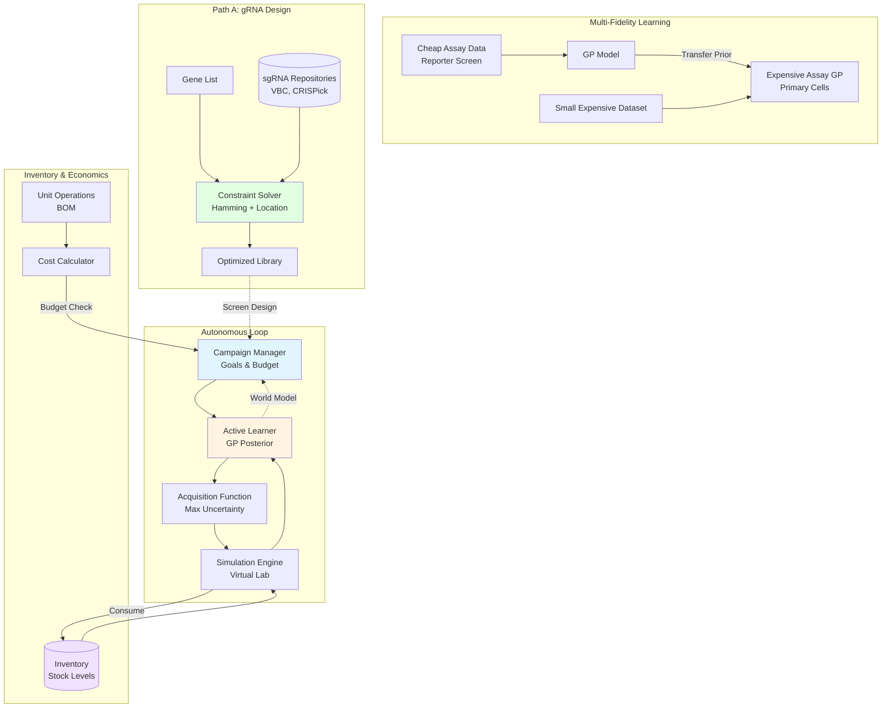

# cell_OS

**A Silicon-based "Lila SSI" for Autonomous Cell Biology.**

`cell_OS` is a prototype operating system for autonomous scientific discovery. It is designed to reason about biological experiments, manage resources, and execute goal-directed campaigns.

## Core Architecture

The system is built on three pillars of "Scientific Superintelligence" (SSI):

1.  **World Model (Phase 0)**: A probabilistic representation of the biological world (Gaussian Processes), learned from baseline data.
2.  **Campaign Manager (Goal Seeking)**: A high-level orchestration layer that pursues specific scientific objectives (e.g., "Find a selective compound").
3.  **Economic Engine (Physics of Cost)**: A detailed economic model that calculates the true cost, time, and risk of assays by breaking them down into atomic Unit Operations (UOs) and Bill of Materials (BOM).

## ✨ New Features

### Multi-Fidelity Learning
Transfer knowledge from cheap assays (e.g., reporter screens) to expensive assays (e.g., primary cells):
```python
# Train on cheap assay
reporter_gp = DoseResponseGP.from_dataframe(df_reporter, ...)

# Transfer to expensive assay with prior knowledge
primary_gp = DoseResponseGP.from_dataframe_with_prior(
    df_primary, ..., 
    prior_model=reporter_gp,
    prior_weight=0.3
)
```

### Inventory Depletion Tracking
Realistic resource management with stock tracking:
```python
inventory = Inventory("data/raw/pricing.yaml")

# Check availability before experiments
availability = inventory.check_availability(bom_items)

# Consume reagents
inventory.consume("DMEM_MEDIA", 500.0, "mL")
```

### gRNA Design Integration
Constraint-based solver for optimal guide library design:
- Hamming distance constraints for barcode conflicts
- Location overlap prevention
- Score optimization (VBC, CRISPick)
- Integration with Path A workflow

## Quick Start

```bash
# Install dependencies
pip install -r requirements.txt

# Run autonomous loop (demo)
python scripts/run_loop.py

# Launch dashboard
streamlit run scripts/dashboard.py

# Design gRNA library
python src/create_library.py \
  --config_yaml data/raw/guide_design.yaml \
  --repositories_yaml data/raw/guide_repositories.yaml \
  --output-path library.csv
```

## Directory Structure

```
cell_OS/
├── config/              # Configuration files (repos, designs)
├── data/
│   ├── inventory.py      # Inventory and Cost calculation logic
│   ├── modeling.py       # Gaussian Process models
│   ├── recipe_optimizer.py # Method optimization logic
│   ├── reporting.py      # Mission Log generator
│   ├── simulation.py     # In-silico wet lab
│   ├── unit_ops.py       # Recipe definitions
│   └── workflow_optimizer.py # ROI analysis
├── results/              # Experiment outputs and logs
├── run_loop.py           # Main entry point
└── requirements.txt
```

## Getting Started

### 1. Setup Environment
```bash
python -m venv env
source env/bin/activate
pip install -r requirements.txt
```

### 2. Run a Campaign
The default campaign seeks a compound selective for HepG2 over U2OS, optimizing for budget.
```bash
python run_loop.py
```

### 3. Verify Costs & Optimization
Check the cost models and decision support tools:
```bash
# Verify Cost-Aware System (Recipe & Workflow Optimization)
python verify_cost_aware_system.py

# Verify Automation Analysis
python verify_automation_analysis.py

# Verify Cell Line Database
python verify_cell_line_database.py
```

## Architecture



## Roadmap

*   [x] **Mission Logs**: Explainable AI decisions.
*   [x] **Economic Engine**: Granular cost modeling with Inventory & BOM.
*   [x] **Complex Protocols**: iMicroglia, NGN2, Phagocytosis.
*   [x] **Assay Selector**: Agent chooses *which* assay to run based on ROI.
*   [x] **Cost-Aware Decision Support**: Recipe and Workflow optimization.
*   [ ] **Multi-Fidelity Learning**: Transfer learning from cheap assays to expensive ones.
*   [ ] **Multi-Fidelity Learning**: Transfer learning from cheap assays to expensive ones.

## Recent Updates

- Added **Zombie POSH** protocol implementation, including decross‑linking, T7 IVT operations, and a complete recipe function.
- Created a **shopping list generator** (`src/zombie_posh_shopping_list.py`) for Zombie POSH experiments.
- Developed **QC checkpoints** (`zombie_posh_qc_checkpoints.md`) covering critical stages of the Zombie POSH workflow.
- Implemented a **modular Cell Painting panel system** (`src/cellpaint_panels.py`) with core, specialized (NeuroPaint, HepatoPaint, ALSPaint), and custom panels, plus automatic secondary antibody selection.
- Updated **pricing.yaml** with detailed reagent costs for Zombie POSH and new Cell Painting dyes/antibodies.
- Added verification script `tests/integration/verify_zombie_posh.py` to validate Zombie POSH operations and cost savings.
- Refactored `src/unit_ops.py` to include new operations (`op_decross_linking`, `op_t7_ivt`, `op_hcr_fish`, `op_ibex_immunofluorescence`) and updated the Zombie POSH recipe.
- Updated documentation files (`zombie_posh_protocol.md`, `zombie_posh_inhouse_protocol.md`).

## Philosophy

This repo treats biology as a landscape that can be learned.

*   **Phase 0**: Model noise, model drift, model curves, model uncertainty.
*   **Phase 1**: Choose experiments that reduce ignorance per unit pain.

Nothing here is optimized. This is the backbone you iterate on.

The OS grows from here.
