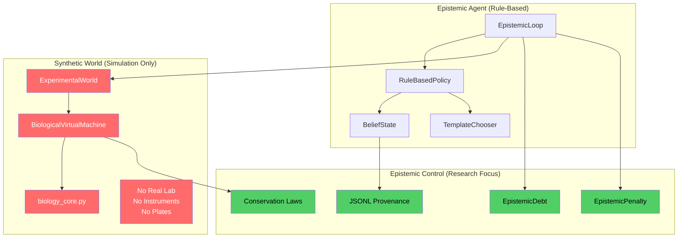

# cell_OS

**Epistemic Control Research Testbed for Autonomous Experimentation**

[]()
[]()

---

## ⚠️ What This Is

This is a **simulation-first research testbed** for studying epistemic honesty in autonomous experimental agents. It generates **100% synthetic cell biology data** to test whether agents can:

1. **Earn calibration before claiming biological knowledge** (pay-for-calibration)
2. **Track epistemic debt when overclaiming information gain**
3. **Refuse to act when uncertainty is too high**
4. **Maintain conservation laws** (death accounting, mass balance)
5. **Provide auditable provenance** for every belief change

**All experimental data is simulated.** The biology engine (`BiologicalVirtualMachine`) generates realistic Cell Painting morphology and LDH cytotoxicity readouts with configurable noise, batch effects, and edge biases. No wet-lab integration exists.

---

## 🚫 What This Is NOT

- ❌ **Not a Bayesian optimization library** (not Ax, not BoTorch)
- ❌ **Not ready for real laboratory hardware** (no SiLA2, no vendor APIs)
- ❌ **Not a general-purpose active learning framework**
- ❌ **Not trained on real assay data** (mechanism signatures are hardcoded)
- ❌ **Not optimizing a target metric** (agent explores and calibrates, doesn't optimize)

**If you need wet-lab automation:** This is not your tool. The value is the **epistemic control machinery** (debt tracking, conservation enforcement, provenance ledgers), not the biology simulator.

**If you need Bayesian optimization:** Use Ax/BoTorch. This agent uses rule-based heuristics with evidence receipts, not Gaussian processes.

---

## 🎯 Core Research Question

**"Can autonomous agents be forced to be honest about what they don't know?"**

Most active learning systems optimize acquisition functions without tracking whether their uncertainty estimates are trustworthy. This testbed enforces:

- **Pay upfront for calibration** → Agent must earn "noise gate" (CI width ≤ 25%) before biology experiments
- **Overclaiming has consequences** → Epistemic debt accumulates when claimed information gain exceeds actual
- **Conservation laws are hard constraints** → Death accounting must sum to 1.0 within 1e-9, or crash
- **Every belief change has a receipt** → JSONL ledgers document supporting evidence

The simulator provides a **controlled adversarial environment** where agents can be tempted to overclaim (mechanism cosplay via nuisance factors, subpopulation heterogeneity collapsing confidence, batch effects mimicking biology).

---

## 🚀 Quick Start

```bash
# Clone and install
git clone https://github.com/your-org/cell_OS.git
cd cell_OS
python -m venv venv
source venv/bin/activate  # On Windows: venv\Scripts\activate
pip install -e .

# Run epistemic agent (generates SYNTHETIC data)
python scripts/run_epistemic_agent.py --cycles 20 --budget 384 --seed 42

# Output: evidence.jsonl, diagnostics.jsonl, decisions.jsonl
# All measurements are simulated - no real cells involved
```

**What happens:**
1. Agent proposes DMSO baseline replicates (calibration phase)
2. Simulated world returns morphology measurements with realistic noise
3. Agent computes pooled variance, checks if "noise gate" earned
4. If gate earned: explores compounds. If lost: returns to calibration
5. All decisions logged to JSONL ledgers with provenance

**Success = Agent earns gate without overspending budget**, not "found optimal compound."

---

## 🏗️ Architecture (All Components Are Synthetic)



**Red = Simulation** (generates synthetic data)
**Green = Epistemic machinery** (the actual research contribution)

---

## 📖 System Components

### 1. BiologicalVirtualMachine (Synthetic Data Generator)

**Purpose**: Generate realistic cell assay measurements with known ground truth

**File**: `src/cell_os/hardware/biological_virtual.py` (3386 lines)

**What it does**:
- Simulates cell viability via Hill curves (dose-response)
- Generates Cell Painting morphology (5 channels: ER, Mito, Nucleus, Actin, RNA)
- Enforces death conservation: `viable + Σ(death_modes) = 1.0 ± 1e-9`
- Adds realistic noise: multiplicative lognormal (no negative signals)
- Injects batch effects, edge biases, washout contamination
- **Critically**: Biology is observer-independent (cell fate same whether measured or not)

**Not connected to**: Any real lab equipment, databases, or vendor APIs

---

### 2. Epistemic Agent (Rule-Based Policy)

**Purpose**: Autonomous experiment selection under pay-for-calibration regime

**Files**:
- `src/cell_os/epistemic_agent/loop.py` (main orchestration)
- `src/cell_os/epistemic_agent/beliefs/state.py` (tracks what agent knows)
- `src/cell_os/epistemic_agent/acquisition/chooser.py` (selects next experiment)

**What it does**:
- Proposes experiments (baseline, edge test, dose-response)
- Updates beliefs from observations (pooled variance, edge effects, dose curvature)
- **Noise gate**: Must earn CI width ≤ 25% before biology experiments
- **Gate hysteresis**: Enter at 0.25, exit at 0.40 (prevents flapping)
- Writes evidence receipts to JSONL for every belief change

**What it does NOT do**:
- Optimize a target metric
- Use Gaussian process regression
- Train neural networks
- Adapt to real lab failures

---

### 3. Epistemic Control System (Research Contribution)

**Purpose**: Enforce honesty about uncertainty

**Files**:
- `src/cell_os/epistemic_control.py` - Debt tracking
- `src/cell_os/epistemic_debt.py` - Information gain computation
- `src/cell_os/epistemic_penalty.py` - Cost inflation from debt

**What it does**:
- **Tracks epistemic debt**: `debt += max(0, claimed_gain - actual_gain)`
- **Inflates costs**: Future experiments cost more if agent overclaimed
- **Asymmetric penalties**: Overclaiming hurts, underclaiming doesn't
- **Currently**: Tracks debt but doesn't block execution (integration incomplete)

**Research hypothesis**: Agents with debt tracking will learn to be conservative in information gain claims.

---

### 4. Conservation Law Enforcement

**Purpose**: Prevent silent violations of physical constraints

**Location**: `biological_virtual.py` lines 1152-1238

**Enforced invariants**:
```python
# Death accounting (hard error if violated)
total = viable_frac + sum([
    death_compound,
    death_starvation,
    death_mitotic_catastrophe,
    death_er_stress,
    death_mito_dysfunction,
    death_confluence,
    death_unknown
])
assert abs(total - 1.0) < DEATH_EPS  # 1e-9 tolerance
```

**Why this matters**: Many biological simulators silently renormalize when mass doesn't balance. This system crashes instead, forcing explicit accounting of every death pathway.

---

## 🔬 Example Run (Synthetic Data Only)

```bash
python scripts/run_epistemic_agent.py --cycles 20 --budget 384 --seed 42
```

**Cycle 1-3**: Agent proposes DMSO replicates (n=32), measures noise
- Computes pooled variance across wells: σ² = SSE / df
- Chi-square confidence interval for σ: [σ_low, σ_high]
- Relative width: (σ_high - σ_low) / σ_hat
- **Gate earned if**: rel_width ≤ 0.25

**Cycle 4-6**: If gate earned, runs edge tests (center vs edge wells)
- Measures whether edge wells show 10-15% signal reduction
- Updates `edge_effect_confident` flag with evidence receipt

**Cycle 7-20**: Explores compounds at multiple doses
- Proposes dose-response experiments (0.1, 1, 10, 100 µM)
- Observes morphology changes (ER stress → ER channel, Mito dysfunction → Mito channel)
- **Does NOT optimize** (just explores and tracks confidence)

**Output files** (all from synthetic data):
```
results/epistemic_agent/run_20251221_143022_evidence.jsonl
results/epistemic_agent/run_20251221_143022_diagnostics.jsonl
results/epistemic_agent/run_20251221_143022_decisions.jsonl
```

**Success criteria**:
- ✅ Noise gate earned (agent calibrated measurement system)
- ✅ Edge effects characterized (agent learned position bias)
- ✅ Multiple compounds tested (agent explored chemical space)
- ✅ Budget not exhausted (agent was efficient)

**NOT measured**: "Did we find the best compound?" (that's not the research question)

---

## 📊 What The Tests Actually Test

The repository has **10,000+ lines of tests** enforcing epistemic invariants, not biological accuracy.

### Heavily Defended Behaviors

1. **Death conservation** (`tests/phase6a/test_death_accounting_honesty.py`)
   - Verifies `viable + Σ(deaths) = 1.0` after every simulation step
   - Tests that typos in death field names cause immediate failures
   - Checks that `death_unknown` vs `death_unattributed` are semantically distinct

2. **Observer independence** (`tests/phase6a/test_washout_measurement_separation.py`)
   - Runs simulation with/without assay calls
   - Asserts cell viability is bit-identical
   - Ensures measurement noise doesn't feed back into biology

3. **Determinism** (`tests/unit/test_active_learner.py`)
   - Same seed → identical results across machines
   - 1 CPU == 64 CPUs (parallel aggregation correct)
   - RNG streams isolated (assay RNG independent of biology RNG)

4. **Noise gate earning** (`tests/unit/test_active_learner.py`)
   - Verifies agent can't propose biology experiments before calibration
   - Tests gate hysteresis (enter at 0.25, exit at 0.40)
   - Checks symmetric events (gate_event:earned, gate_loss logged)

### Weakly Tested or Untested

1. ~~**Epistemic debt consequences**~~ - Now tested: `tests/integration/test_epistemic_debt_enforcement.py` (13 tests)
2. **Design quality refusals** - Refusal logic exists but no test verifies `refusals.jsonl`
3. **Mechanism classification accuracy** - No ECE validation on held-out set
4. **Multi-cycle gate recovery** - Tests check earning, not losing and re-earning

---

## 🛠️ If You Want To Use This

### For Epistemic Control Research

**You should use this if**:
- Studying agent honesty under adversarial conditions
- Testing calibration requirements for autonomous systems
- Benchmarking provenance/ledger systems
- Developing new uncertainty quantification methods

**What you get**:
- Controlled testbed with known ground truth
- Realistic confounders (batch effects, nuisance factors)
- Full provenance trails (JSONL ledgers)
- Conservation law enforcement examples

**What you need to add**:
- Your own agent policy (`RuleBasedPolicy` is just a baseline)
- Custom epistemic penalties (debt inflation config is tunable)
- Your own mechanism signatures (currently hardcoded)

---

### For Wet-Lab Integration (Not Supported)

**Blockers for real lab use**:
1. **No hardware abstraction layer** - `BiologicalVirtualMachine` is simulation-only
2. **No vendor APIs** - No Tecan, Hamilton, or BioTek integration
3. **No LIMS integration** - No data pipelines for real assay readouts
4. **No failure recovery** - Agent assumes infinite reliability
5. **No resource scheduling** - No tracking of consumables, instruments, staff

**What you'd need to build**:
- `HardwareInterface` subclass for real instruments
- Adapter for your lab's data format (Cell Painting profiles, plate reader CSVs)
- Error handling for instrument failures, plate drops, contamination
- Calibration using your lab's real noise characteristics (not simulated)
- Mechanism signatures trained on your assay panel (not hardcoded)

**Estimated effort**: 6-12 months for a single instrument stack.

---

## 🎨 Validation Frontend & QC Tools

**NEW**: Interactive web UI for calibration plate analysis and run management.

### Quick Start

```bash
# Terminal 1: Start dev server (local machine)
cd validation_frontend
npm install
npm run dev

# Terminal 2: Run calibration plate on JupyterHub
cd ~/repos/cell_OS
PYTHONPATH=. python3 src/cell_os/plate_executor_v2_parallel.py \
  validation_frontend/public/plate_designs/CAL_384_RULES_WORLD_v2.json \
  --seed 42 --auto-pull --auto-commit

# Terminal 3: Auto-pull results (local machine)
./auto_pull.sh
```

### Features

#### 1. 📊 Epistemic Documentary (`/documentary`)
- **Timeline Tab**: Cycle-by-cycle agent decision visualization
- **Plate Designs Tab**: Browse calibration plate catalog
- **Calibration Plate Tab**: Interactive plate design viewer with simulate button
- **Runs Tab**: Browse all simulation runs with filtering and comparison

#### 2. 🧪 Calibration Plate Executor
- **Unique Run IDs**: Timestamp-based identifiers for each run
- **Runs Manifest**: Automatic tracking of all runs in `runs_manifest.json`
- **Auto-pull/Auto-commit**: Seamless workflow from JupyterHub → GitHub → local UI
- **Parallel Execution**: 384 wells in ~2-3 minutes on 31 workers

#### 3. 🔬 QC Analysis Dashboard
After running a plate, click "View Results" to see:

**Replicate Precision (Tile CV)**
- Coefficient of variation for 2x2 replicate tiles
- Color-coded: Green (< 10%), Yellow (10-20%), Red (> 20%)
- Target: < 10% for excellent reproducibility

**Assay Quality (Z-Factor)**
- Industry-standard validation metric
- Compares DMSO vs MILD/STRONG anchors
- Z' > 0.5 = excellent, 0-0.5 = acceptable, < 0 = poor

**Spatial Effects**
- Bar charts showing mean signal by row/column
- Detects edge effects and gradients
- Helps identify position-dependent artifacts

**Channel Correlation Matrix**
- Pearson correlation between all channels
- Identifies redundant vs orthogonal features
- Color intensity = correlation strength

#### 4. 🔄 Run Management
- **Browse all runs**: Filterable by plate design
- **Compare runs**: View multiple runs side-by-side
- **Download results**: Export JSON for analysis
- **Auto-refresh**: New runs appear automatically

### Workflow


### Available Plate Designs

1. **CAL_384_RULES_WORLD_v1** - Simple calibration (anchors + tiles)
2. **CAL_384_RULES_WORLD_v2** - Advanced (density gradient + probes)
3. **CAL_384_MICROSCOPE_BEADS_DYES_v1** - Instrument calibration
4. **CAL_384_LH_ARTIFACTS_v1** - Liquid handler QC
5. **CAL_VARIANCE_PARTITION_v1** - Variance decomposition
6. **CAL_EL406_WASH_DAMAGE_v1** - Wash stress testing
7. **CAL_DYNAMIC_RANGE_v1** - Dynamic range mapping

---

## 📂 Project Structure

```
cell_OS/
├── src/cell_os/
│   ├── epistemic_agent/              # Agent + belief tracking
│   │   ├── loop.py                   # Main orchestration
│   │   ├── beliefs/state.py          # What agent knows
│   │   └── acquisition/chooser.py    # Experiment selection
│   ├── hardware/
│   │   ├── biological_virtual.py     # Synthetic data generator (3386 lines)
│   │   └── mechanism_posterior_v2.py # Bayesian inference (for beam search)
│   ├── sim/
│   │   └── biology_core.py           # Pure pharmacology functions
│   ├── epistemic_control.py          # Debt tracking
│   ├── epistemic_debt.py             # Information gain computation
│   ├── epistemic_penalty.py          # Cost inflation
│   └── plate_executor_v2_parallel.py # Calibration plate executor (parallel)
├── validation_frontend/              # 🆕 Interactive web UI
│   ├── src/
│   │   ├── pages/
│   │   │   ├── EpistemicDocumentaryPage.tsx  # Main dashboard
│   │   │   └── CalibrationResultsLoaderPage.tsx  # QC analysis viewer
│   │   ├── components/
│   │   │   ├── RunsBrowser.tsx        # Run management UI
│   │   │   ├── CalibrationQCAnalysis.tsx  # QC metrics
│   │   │   └── PlateDesignCatalog.tsx  # Design browser
│   │   └── public/
│   │       ├── plate_designs/         # JSON plate definitions
│   │       └── demo_results/
│   │           └── calibration_plates/
│   │               └── runs_manifest.json  # Run tracking
├── tests/                            # 10K+ lines of epistemic invariant tests
│   ├── unit/                         # Component tests
│   ├── integration/                  # Agent + world integration
│   └── phase6a/                      # Conservation laws, honesty, confluence
├── scripts/
│   ├── run_epistemic_agent.py        # Main agent entry point
│   └── analysis/                     # Analysis utilities
├── auto_pull.sh                      # 🆕 Auto-sync results from GitHub
└── docs/
    ├── PHASE0_FOUNDER_FIXED_SCAFFOLD_COMPLETE.md
    ├── PHASE1_AGENT_SUMMARY.md
    └── INJECTION_B_BOUNDARY_SEMANTICS_COMPLETE.md
```

---

## 🎯 Research Phases (What "Complete" Means)

### ✅ Phase 0: Synthetic Data Generator
**Goal**: Generate realistic cell assay data with known ground truth

**Deliverables**:
- Death conservation enforcement (hard errors)
- Observer-independent physics (measurement doesn't affect fate)
- Deterministic execution (same seed → identical results)
- 5-channel Cell Painting + LDH cytotoxicity

**NOT delivered**: Real lab integration

---

### ✅ Phase 1: Pay-For-Calibration
**Goal**: Agents must earn measurement noise characterization before biology

**Deliverables**:
- Noise gate: CI width ≤ 25% of estimate
- Gate hysteresis (prevent flapping)
- Evidence ledgers (JSONL receipts)
- Template library (baseline, edge test, dose-response)

**NOT delivered**: Optimization (agent explores, doesn't optimize)

---

### ✅ Phase 5: Population Heterogeneity
**Goal**: Confidence collapses when subpopulations disagree

**Deliverables**:
- 3-bucket mixture model (sensitive/typical/resistant)
- Per-bucket IC50 shifts
- Confidence penalty when buckets disagree

**NOT delivered**: Hierarchical Bayesian inference

---

### ✅ Phase 6A: Epistemic Control
**Goal**: Track epistemic debt, enforce conservation laws

**Deliverables**:
- Debt tracking (overclaiming accumulates penalty)
- Calibrated confidence (ECE = 0.0626 on synthetic validation)
- Beam search with COMMIT gating (≥0.75 confidence threshold)
- Fixed semantic bugs (death accounting, conservation violations)

**Delivered**: Debt enforcement with hard block at 2.0 bits threshold (see `tests/integration/test_epistemic_debt_enforcement.py`)

---

### 🚧 Phase 6B: Realism Improvements (In Progress)
**Goal**: More realistic confounders

**Planned**:
- Volume/evaporation dynamics (concentration drift)
- Plate-level gradients (temperature, illumination)
- pH/waste as secondary stress axis

**Not planned**: Instrument-specific failure modes (belongs in wet-lab layer)

---

### 🚧 Phase 7: Advanced Discovery (Future)
**NOT started, may never ship**:
- Multi-fidelity learning
- Hit calling pipeline
- Real hardware integration

---

## 🧪 Testing

```bash
# Run full test suite (10K+ lines)
pytest

# Focus on epistemic invariants
pytest tests/phase6a/

# Focus on agent behavior
pytest tests/unit/test_active_learner.py

# Check death conservation
pytest tests/phase6a/test_death_accounting_honesty.py
```

**What tests verify**:
- Death conservation (sum = 1.0)
- Observer independence (measurement doesn't affect biology)
- Determinism (same seed → identical results)
- Noise gate earning (can't skip calibration)
- Evidence provenance (every belief change logged)

**What tests do NOT verify**:
- Biological accuracy (IC50 values are made up)
- Clinical relevance (compounds are model systems)
- Wet-lab feasibility (simulation-only)

---

## 📚 Documentation

### Start Here
- **[What We Built](docs/WHAT_WE_BUILT.md)** - System overview (if exists)
- **[Phase 0 Milestone](PHASE0_FOUNDER_FIXED_SCAFFOLD_COMPLETE.md)** - Synthetic data generator
- **[Phase 1 Milestone](PHASE1_AGENT_SUMMARY.md)** - Pay-for-calibration agent

### Deep Dives
- **[Biology Simulation Evolution](docs/BIOLOGY_SIMULATION_EVOLUTION.md)** - How death accounting was fixed
- **[Observer Independence](docs/OBSERVER_INDEPENDENCE_COMPLETE.md)** - Why measurement can't affect fate
- **[Provenance & Scaffolding](docs/PROVENANCE_AND_SCAFFOLDING.md)** - JSONL ledger system
- **[Epistemic Control System](docs/EPISTEMIC_SYSTEM_COMPLETE.md)** - Debt tracking architecture

### For Developers
- **[Developer Reference](docs/DEVELOPER_REFERENCE.md)** - Local setup
- **[Testing Guide](docs/testing/)** - How to run tests
- **[Code Review Guide](docs/guides/)** - Contribution standards

---

## ⚖️ Design Principles (Actual, Not Aspirational)

1. **Crash loudly, never silently renormalize**
   - Conservation violations → `ConservationViolationError` (not warning)
   - Missing death attribution → hard error (not `death_other`)
   - Invalid designs → refuse and log (not accept and warn)

2. **Every belief change has a receipt**
   - JSONL ledgers for evidence, diagnostics, decisions
   - Field-level provenance (which belief changed, why)
   - Symmetric events (gate_event:earned + gate_loss)

3. **Simulation is not the product, epistemic machinery is**
   - Biology simulator is a **controlled testbed**
   - Research contribution is **debt tracking, conservation laws, provenance**
   - Value is the **forcing functions** (pay-for-calibration, conservation enforcement)

4. **Observer independence is non-negotiable**
   - Cell fate must be identical with/without measurement
   - RNG streams isolated (biology vs assay)
   - Tests verify bit-identical results

5. **Determinism enables accountability**
   - Same seed → identical results (cross-machine)
   - Parallel execution → same results as serial
   - Makes bugs reproducible

---

## 🤝 Contributing

**This is a research testbed, not production software.**

Contributions welcome for:
- New epistemic control mechanisms (debt variants, penalty functions)
- Better calibration requirements (multi-assay gates)
- Conservation law extensions (energy balance, stoichiometry)
- Provenance system improvements (cryptographic commitments)

Not accepting:
- Wet-lab integration PRs (scope too large, needs separate project)
- Biological accuracy improvements without epistemic relevance
- Performance optimizations for biology simulator (fast enough)

---

## 📜 License

MIT License - See [LICENSE](LICENSE) for details.

---

## ❓ FAQ

**Q: Can I use this with my real lab data?**
A: No. This generates synthetic data only. You'd need to build a hardware interface, adapt data formats, and recalibrate all noise models.

**Q: Is this a Bayesian optimization library?**
A: No. The agent uses rule-based heuristics, not BO. It explores and calibrates, doesn't optimize.

**Q: What's the point of synthetic data?**
A: Controlled testbed for epistemic control research. We know ground truth, can inject adversarial confounders, and verify agents are honest about uncertainty.

**Q: When will Phase 7 be done?**
A: Unknown. Phases are research milestones, not product releases. Phase 7 may never ship.

**Q: Can I train the mechanism signatures on my data?**
A: Not currently supported. Signatures are hardcoded in `mechanism_posterior_v2.py`. You'd need to build a training pipeline.

**Q: Why 10K+ lines of tests for 2K lines of simulation?**
A: Because epistemic honesty is hard. Most bugs are silent (wrong conservation, measurement feedback loops, RNG coupling). Tests enforce invariants that don't show up in outputs.

---

**Questions?** See [docs/DEVELOPER_REFERENCE.md](docs/DEVELOPER_REFERENCE.md) or open an issue.

**Want real lab automation?** This is not the right starting point. Consider:
- Emerald Cloud Lab (commercial)
- SiLA2 standard (instrument abstraction)
- Strateos API (cloud lab platform)
- Opentrons Python API (open source liquid handling)
