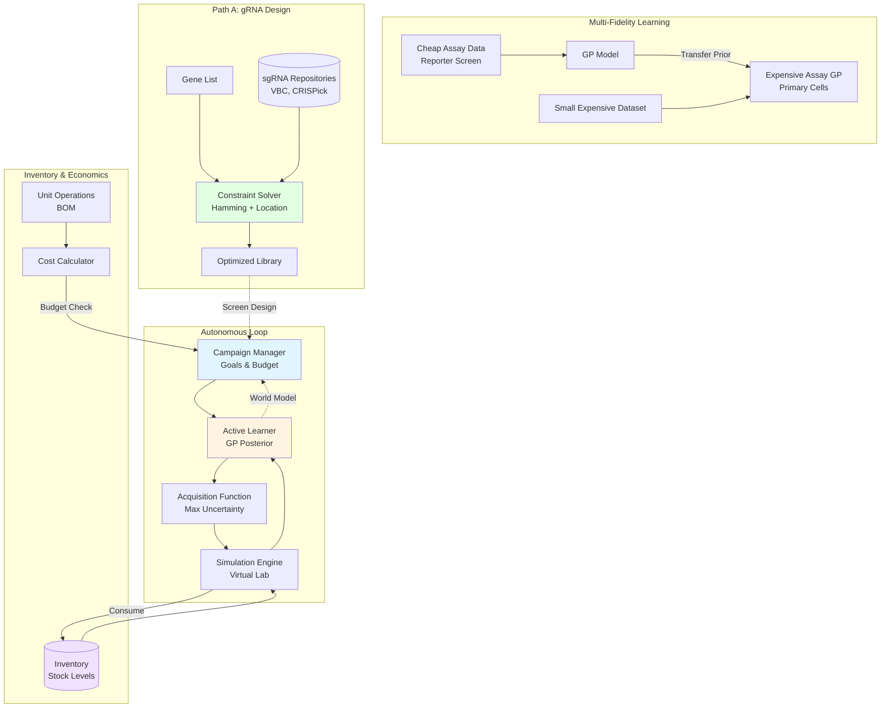

# cell_OS

**A Silicon-based "Lila SSI" for Autonomous Cell Biology.**

`cell_OS` is a prototype operating system for autonomous scientific discovery. It is designed to reason about biological experiments, manage resources, and execute goal-directed campaigns.

## Core Architecture

The system is built on three pillars of "Scientific Superintelligence" (SSI):

1.  **World Model (Phase 0)**: A probabilistic representation of the biological world (Gaussian Processes), learned from baseline data.
2.  **Campaign Manager (Goal Seeking)**: A high-level orchestration layer that pursues specific scientific objectives (e.g., "Find a selective compound").
3.  **Economic Engine (Physics of Cost)**: A detailed economic model that calculates the true cost, time, and risk of assays by breaking them down into atomic Unit Operations (UOs) and Bill of Materials (BOM).

## ✨ New Features

### Multi-Fidelity Learning
Transfer knowledge from cheap assays (e.g., reporter screens) to expensive assays (e.g., primary cells):
```python
# Train on cheap assay
reporter_gp = DoseResponseGP.from_dataframe(df_reporter, ...)

# Transfer to expensive assay with prior knowledge
primary_gp = DoseResponseGP.from_dataframe_with_prior(
    df_primary, ..., 
    prior_model=reporter_gp,
    prior_weight=0.3
)
```

### Inventory Depletion Tracking
Realistic resource management with stock tracking:
```python
inventory = Inventory("data/raw/pricing.yaml")

# Check availability before experiments
availability = inventory.check_availability(bom_items)

# Consume reagents
inventory.consume("DMEM_MEDIA", 500.0, "mL")
```

### gRNA Design Integration
Constraint-based solver for optimal guide library design:
- Hamming distance constraints for barcode conflicts
- Location overlap prevention
- Score optimization (VBC, CRISPick)
- Integration with Path A workflow

### ImagingDoseLoop: Closed-Loop Autonomous Imaging
A working autonomous loop for stress-window optimization:
```python
from cell_os.imaging_loop import ImagingDoseLoop
from cell_os.imaging_world_model import ImagingWorldModel
from cell_os.imaging_goal import ImagingWindowGoal

# Define goal: viability band + stress objective + QC thresholds
goal = ImagingWindowGoal(
    viability_min=0.8,
    viability_max=1.0,
    min_cells_per_field=280,
    min_fields_per_well=100
)

# Initialize with empty GPs (or seed with prior data)
wm = ImagingWorldModel.from_dicts(viability_gps, stress_gps, qc_gps)

# Run closed loop: propose → execute → refit → repeat
loop = ImagingDoseLoop(world_model=wm, executor=executor, goal=goal)
batch = loop.run_one_cycle(dose_grid=np.logspace(-3, 2, 200))
```

**Key Features:**
- **Viability Window**: Filters doses to maintain cell health (e.g., 80-100% viability)
- **QC Constraints**: Ensures sufficient cells/field and good fields/well for reliable imaging
- **Stress Maximization**: Ranks viable doses by stress metric (e.g., CellROX)
- **Posterior Refitting**: Automatically updates GP models after each cycle using `DoseResponseGP`
- **Smooth Adaptation**: QC thresholds act as continuous knobs, not binary gates

**Verified Behavior:**
- Increasing `min_cells_per_field` from 240 → 280 smoothly shifts optimal dose from 0.44 → 0.22 µM
- Seeding with toxic doses (1.0, 10.0 µM) causes loop to avoid high-dose region and propose safer alternatives
- Refitting enables closed-loop learning: Data → History → GP Update → New Proposal

**Acquisition Personalities:**
The loop's decision-making is controlled by `AcquisitionConfig`, which defines how it balances stress maximization against viability and QC constraints. For POSH pre-screens, use:

```python
from cell_os.acquisition_config import AcquisitionConfig
config = AcquisitionConfig.posh_optimizer()
```

This stance maximizes morphological richness while keeping the assay operational. It is designed for single-shot POSH screens where you need maximum phenotypic information from an expensive, non-repeatable experiment. The loop lives at the boundary between order and collapse - where stress transcription is high, morphology is rich, but segmentation remains intact.

**POSH Pooled Capacity:**
For pooled POSH screens, the system uses a barcode-based capacity model instead of plate-based constraints. For A549 cells, we assume:
- 500,000 cells per well
- 60% ISS (in situ sequencing) efficiency
- 1,000 cells required per gene KO for robust profiling

This yields approximately **300 genes × 4 guides = 1,200 perturbations per pooled screen**.

### Morphology Engine & Phenotypic Diversity
The system now includes a `MorphologyEngine` protocol for extracting features from images to drive diversity-based acquisition:
```python
from cell_os.morphology_engine import FakeMorphologyEngine
from cell_os.perturbation_goal import PerturbationPosterior

# Initialize engine (plug in real models like CellProfiler/DeepProfiler later)
engine = FakeMorphologyEngine(n_features=512)

# Posterior tracks morphological embeddings
posterior = PerturbationPosterior(morphology_engine=engine)

# Update with image paths -> extracts features -> updates embeddings
posterior.update_with_images("TP53", ["img1.tif", "img2.tif"])

# Compute diversity score for a set of genes
diversity = posterior.diversity_score(["TP53", "MDM2", "KRAS"])
```
This enables the `PerturbationAcquisitionLoop` to select genes that maximize phenotypic diversity, exploring the "morphological space" of the cell.

### Acquisition Profiles: Loop Personalities

Control how the autonomous loop trades off stress, viability, uncertainty, and diversity with 4 built-in profiles:

| Profile | Viability | Diversity | Best For |
|---------|-----------|-----------|----------|
| **balanced** | 0.7-0.9 | 0.5 | General use, starting point |
| **ambitious_postdoc** | 0.5-0.85 | 0.7 | Discovery, EC50 mapping |
| **cautious_operator** | 0.85-1.0 | 0.2 | Production, reproducibility |
| **wise_pi** | 0.75-0.9 | 0.6 | Iterative optimization |

```bash
# Run with different personalities
python scripts/run_posh_campaign_demo.py --profile balanced
python scripts/run_posh_campaign_demo.py --profile ambitious_postdoc
python scripts/run_posh_campaign_demo.py --profile cautious_operator

# Compare results
python scripts/compare_profiles.py
```

See [docs/acquisition_profiles.md](docs/acquisition_profiles.md) for detailed guide.

## Quick Demo

Run a complete simulated POSH campaign (gene selection → execution → hit calling):

```bash
python scripts/run_posh_campaign_demo.py
```

This will generate `results/posh_demo_hits.csv` with ranked hits based on morphological shift.

**Run the imaging loop smoketest:**
```bash
python scripts/imaging_loop_smoketest.py
```

## Scenario System

Run complete experimental campaigns with predefined configurations:

```bash
# List available scenarios
python -m src.run_scenario --list

# Run a scenario
python -m src.run_scenario --name cheap_pilot
python -m src.run_scenario --name posh_window_finding
python -m src.run_scenario --name high_risk_morphology
```

### Available Scenarios

| Scenario | Budget | Inventory | Profile | Description |
|----------|--------|-----------|---------|-------------|
| **cheap_pilot** | $500 | Limited | cautious_operator | Low-budget pilot study |
| **posh_window_finding** | $2,000 | Standard | balanced | Standard POSH screen |
| **high_risk_morphology** | $5,000 | Abundant | ambitious_postdoc | Aggressive exploration |

Each scenario bundles:
- Campaign budget and failure mode
- Initial inventory (plates, media, reagents)
- Morphology engine configuration
- Acquisition profile (stress/viability trade-offs)

### Sample Report Card

```
======================================================================
CAMPAIGN SUMMARY REPORT
======================================================================

BUDGET
----------------------------------------------------------------------
  Total Budget:      $500.00
  Spent:             $127.45 (25.5%)
  Remaining:         $372.55

INVENTORY USAGE
----------------------------------------------------------------------
  6-Well Plate:
    Starting:  5.0 plate
    Consumed:  2.0 plate (40.0%)
    Remaining: 3.0 plate
  DMEM Media:
    Starting:  100.0 mL
    Consumed:  24.0 mL (24.0%)
    Remaining: 76.0 mL

EXPERIMENTAL COVERAGE
----------------------------------------------------------------------
  Perturbations:     20
  Total Wells:       60
  Unique Conditions: 60

MORPHOLOGY
----------------------------------------------------------------------
  Embeddings:        60
  Mean Pairwise Dist: 1.234 ± 0.456

TERMINATION
----------------------------------------------------------------------
  Status:            completed
  Cycles Completed:  1 / 3
  Goal Met:          No

======================================================================
```

See [src/cell_os/scenarios.py](src/cell_os/scenarios.py) to customize or create new scenarios.

## Quick Start

```bash
# Install dependencies
pip install -r requirements.txt

# Run autonomous loop (demo)
python scripts/run_loop.py

# Launch dashboard
streamlit run scripts/dashboard.py

# Design gRNA library
python src/create_library.py \
  --config_yaml data/raw/guide_design.yaml \
  --repositories_yaml data/raw/guide_repositories.yaml \
  --output-path library.csv
```

## Directory Structure

```
cell_OS/
├── config/              # Configuration files (repos, designs)
├── data/
│   ├── inventory.py      # Inventory and Cost calculation logic
│   ├── modeling.py       # Gaussian Process models
│   ├── recipe_optimizer.py # Method optimization logic
│   ├── reporting.py      # Mission Log generator
│   ├── simulation.py     # In-silico wet lab
│   ├── unit_ops.py       # Recipe definitions
│   └── workflow_optimizer.py # ROI analysis
├── results/              # Experiment outputs and logs
├── run_loop.py           # Main entry point
└── requirements.txt
```

## Getting Started

### 1. Setup Environment
```bash
python -m venv env
source env/bin/activate
pip install -r requirements.txt
```

### 2. Run a Campaign
The default campaign seeks a compound selective for HepG2 over U2OS, optimizing for budget.
```bash
python run_loop.py
```

### 3. Verify Costs & Optimization
Check the cost models and decision support tools:
```bash
# Verify Cost-Aware System (Recipe & Workflow Optimization)
python verify_cost_aware_system.py

# Verify Automation Analysis
python verify_automation_analysis.py

# Verify Cell Line Database
python verify_cell_line_database.py
```

## Architecture



## Roadmap

*   [x] **Mission Logs**: Explainable AI decisions.
*   [x] **Economic Engine**: Granular cost modeling with Inventory & BOM.
*   [x] **Complex Protocols**: iMicroglia, NGN2, Phagocytosis.
*   [x] **Assay Selector**: Agent chooses *which* assay to run based on ROI.
*   [x] **Cost-Aware Decision Support**: Recipe and Workflow optimization.
*   [ ] **Multi-Fidelity Learning**: Transfer learning from cheap assays to expensive ones.
*   [ ] **Multi-Fidelity Learning**: Transfer learning from cheap assays to expensive ones.

## Recent Updates

- Added **Zombie POSH** protocol implementation, including decross‑linking, T7 IVT operations, and a complete recipe function.
- Created a **shopping list generator** (`src/zombie_posh_shopping_list.py`) for Zombie POSH experiments.
- Developed **QC checkpoints** (`zombie_posh_qc_checkpoints.md`) covering critical stages of the Zombie POSH workflow.
- Implemented a **modular Cell Painting panel system** (`src/cellpaint_panels.py`) with core, specialized (NeuroPaint, HepatoPaint, ALSPaint), and custom panels, plus automatic secondary antibody selection.
- Updated **pricing.yaml** with detailed reagent costs for Zombie POSH and new Cell Painting dyes/antibodies.
- Added verification script `tests/integration/verify_zombie_posh.py` to validate Zombie POSH operations and cost savings.
- Refactored `src/unit_ops.py` to include new operations (`op_decross_linking`, `op_t7_ivt`, `op_hcr_fish`, `op_ibex_immunofluorescence`) and updated the Zombie POSH recipe.
- Updated documentation files (`zombie_posh_protocol.md`, `zombie_posh_inhouse_protocol.md`).

## Philosophy

This repo treats biology as a landscape that can be learned.

*   **Phase 0**: Model noise, model drift, model curves, model uncertainty.
*   **Phase 1**: Choose experiments that reduce ignorance per unit pain.

Nothing here is optimized. This is the backbone you iterate on.

The OS grows from here.
