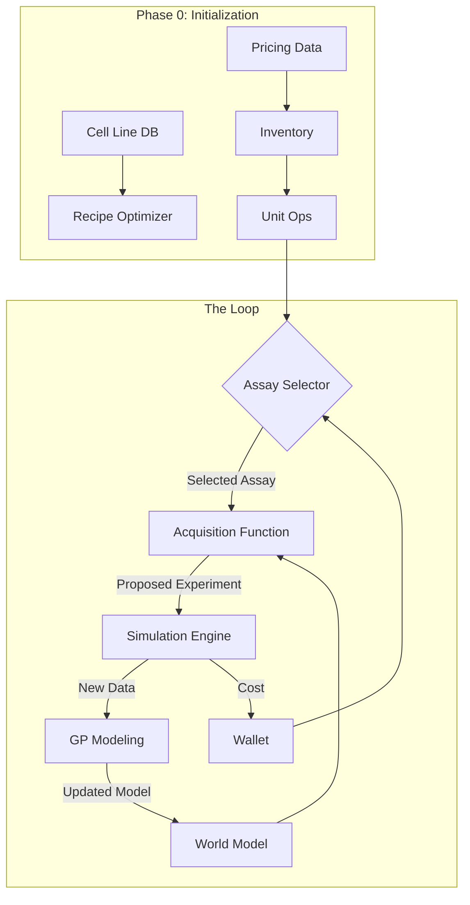

# System Architecture

## Overview

cell_OS is an autonomous research agent designed to optimize cell culture protocols and experimental designs. It operates in a closed loop: simulating experiments, modeling results, and acquiring new data to maximize information gain within budget constraints.

## Core Components

### 1. The Loop (`run_loop.py`)
The central nervous system of the agent. It orchestrates the cycle:
1.  **Assay Selection**: Chooses the best experiment based on budget and information gain.
2.  **Modeling**: Updates Gaussian Process models with new data.
3.  **Acquisition**: Proposes specific experimental conditions (cell, compound, dose).
4.  **Execution**: Simulates the experiment and generates data.

### 2. Economic Engine
Manages resources, costs, and optimization.

-   **Inventory (`src/inventory.py`)**: Tracks reagent costs and stock.
-   **UnitOps (`src/unit_ops.py`)**: Models laboratory operations (atomic and composite) with precise cost and time calculations.
-   **RecipeOptimizer (`src/recipe_optimizer.py`)**: Generates optimized protocols based on cell type, budget, and automation constraints.
-   **WorkflowOptimizer (`src/workflow_optimizer.py`)**: Analyzes workflows to identify cost-saving opportunities.
-   **AutomationAnalysis (`src/automation_analysis.py`)**: Scores operations for automation feasibility and labor costs.

### 3. Scientific Modeling
Understands the biology.

-   **Simulation (`src/simulation.py`)**: Generates synthetic ground truth data (dose-response curves).
-   **Modeling (`src/modeling.py`)**: Fits Gaussian Processes to observed data, handling noise and drift.
-   **Acquisition (`src/acquisition.py`)**: Uses Bayesian Optimization (Expected Improvement) to select the most informative experiments.

### 4. Knowledge Base
Stores domain knowledge.

-   **Cell Line Database (`src/cell_line_database.py`)**: Contains optimal culture conditions and methods for various cell types.
-   **Pricing Data (`data/raw/pricing.yaml`)**: Current market prices for reagents and consumables.
-   **Vessel Library (`data/raw/vessels.yaml`)**: Specifications for labware.

## Data Flow

## Key Classes

-   **`UnitOp`**: Represents a single lab operation (e.g., "Aspirate 10uL").
-   **`AssayRecipe`**: A sequence of UnitOps forming a complete protocol.
-   **`CellLineProfile`**: Biological and technical metadata for a cell line.
-   **`AutomationAnalysis`**: Feasibility report for automating a process.
-   **`CostConstrainedSelector`**: Logic for choosing assays under budget.

## Design Principles

1.  **Granularity**: Costs are modeled from the bottom up (microliters of reagent) for precision.
2.  **Modularity**: Components (Optimizer, Selector, Simulator) are loosely coupled and swappable.
3.  **Parameterization**: Operations are flexible (e.g., `op_passage(method="trypsin")`) rather than hardcoded.
4.  **Cost-Awareness**: Every decision considers the financial impact, mimicking real-world constraints.
