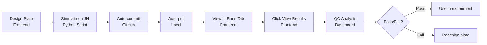

# Cell OS - Validation Frontend

Interactive web UI for calibration plate analysis, run management, and epistemic agent visualization.

## Quick Start

```bash
# Install dependencies
npm install

# Start dev server (runs on http://localhost:5173)
npm run dev
```

## Features

### 📊 Epistemic Documentary (`/documentary`)

Main dashboard with 4 tabs:

1. **Timeline** - Cycle-by-cycle agent decision visualization
   - Shows evidence, decisions, and diagnostics
   - Cost efficiency tracking
   - Playback controls with speed adjustment

2. **Plate Designs** - Browse calibration plate catalog
   - 5+ plate designs with metadata
   - View design goals and parameters
   - Simulate on JupyterHub workflow
   - Download JSON designs

3. **Calibration Plate** - Interactive plate design viewer
   - Design selector dropdown (7 designs)
   - Visual plate layout preview
   - Simulate button → modal with JH command
   - Supports v1, v2, microscope, LH, variance, wash, dynamic designs

4. **Runs** - Browse all simulation runs
   - Filterable by plate design
   - View run metadata (run ID, timestamp, seed)
   - Success rates and execution stats
   - View Results → QC analysis dashboard
   - Download results JSON

### 🧪 Calibration Plate Executor

Python script that runs 384-well plate simulations:

```bash
cd ~/repos/cell_OS
PYTHONPATH=. python3 src/cell_os/plate_executor_v2_parallel.py \
  validation_frontend/public/plate_designs/CAL_384_RULES_WORLD_v2.json \
  --seed 42 --auto-pull --auto-commit
```

Features:
- **Unique Run IDs**: Timestamp-based (e.g., `20251222_192212`)
- **Runs Manifest**: Automatic tracking in `runs_manifest.json`
- **Auto-pull**: Pulls latest code before execution
- **Auto-commit**: Commits results + manifest after completion
- **Parallel**: 384 wells in ~2-3 minutes (31 workers)

### 🔬 QC Analysis Dashboard (`/calibration-results-loader/:plateId`)

After running a plate, view comprehensive QC metrics:

#### 1. Replicate Precision (Tile CV Analysis)
- Calculates CV for 8 tile regions (2x2 replicates)
- Per-channel metrics (DNA, ER, AGP, Mito, RNA)
- Color-coded quality:
  - 🟢 Green: CV < 10% (excellent)
  - 🟡 Yellow: CV 10-20% (OK)
  - 🔴 Red: CV > 20% (poor)

#### 2. Assay Quality (Z-Factor)
- Industry-standard validation metric
- Compares DMSO vs MILD/STRONG anchors
- Per-channel Z-factor:
  - Z' > 0.5: Excellent ✅
  - 0 < Z' < 0.5: Acceptable ⚠️
  - Z' < 0: Poor ❌
- Separation ratio (% change from baseline)

#### 3. Spatial Effects
- Bar charts by row and column
- Detects edge effects and gradients
- DNA channel visualization
- Helps identify position-dependent artifacts

#### 4. Channel Correlation Matrix
- Pearson correlation between all channels
- Color intensity = correlation strength
- Identifies:
  - Redundant features (high correlation)
  - Orthogonal features (low correlation)
  - Potential artifacts (unexpected correlations)

### 🎬 Epistemic Provenance Viewer (`/epistemic-provenance`)

Visualize epistemic agent runs with decision provenance, gate events, and calibration metrics.

**Using Demo Data** (no setup needed):
```bash
npm run dev
# Navigate to http://localhost:5173/epistemic-provenance
```

**Using Your Own Runs**:

1. Generate runs:
   ```bash
   python3 scripts/run_epistemic_agent.py --cycles 20 --budget 384 --seed 42
   ```

2. Generate manifest:
   ```bash
   node scripts/make_runs_manifest.mjs
   ```

3. Symlink results:
   ```bash
   ln -s ../../results public/results
   ```

4. Configure `.env.local`:
   ```bash
   cp .env.local.example .env.local
   # Uncomment: VITE_RESULTS_BASE=/results/epistemic_agent
   ```

## Workflow



## Architecture

### Frontend Stack
- **React 18** with TypeScript
- **Vite** for dev server and build
- **React Router** for navigation
- **Tailwind CSS** for styling
- **Lucide React** for icons

### Key Components

```
src/
├── pages/
│   ├── EpistemicDocumentaryPage.tsx    # Main dashboard
│   ├── CalibrationResultsLoaderPage.tsx # QC viewer
│   ├── EpistemicProvenancePageNew.tsx  # Agent viz
│   └── LandingPage.tsx                 # Home
├── components/
│   ├── RunsBrowser.tsx                 # Run management
│   ├── CalibrationQCAnalysis.tsx       # QC metrics
│   ├── PlateDesignCatalog.tsx          # Design browser
│   ├── CalibrationPlateViewer.tsx      # Plate visualizer
│   └── shared/
│       ├── PlateViewer.tsx             # Generic plate display
│       └── PlateResultsViewer.tsx      # Results display
└── App.tsx                             # Routes
```

### Data Flow

1. **Plate Executor** generates results:
   - File: `CAL_384_RULES_WORLD_v2_run_20251222_192212_seed42.json`
   - Manifest: `runs_manifest.json`

2. **Auto-commit** to GitHub:
   - Both files committed together
   - Git message includes run ID

3. **Auto-pull** script (`auto_pull.sh`) detects changes:
   - Polls every 30 seconds
   - Pulls when new commits detected

4. **Frontend** auto-refreshes:
   - Vite watches `public/` directory
   - New files appear immediately

## Available Plate Designs

Located in `public/plate_designs/`:

1. **CAL_384_RULES_WORLD_v1.json** - Simple calibration (anchors + tiles)
2. **CAL_384_RULES_WORLD_v2.json** - Advanced (density gradient + probes)
3. **CAL_384_MICROSCOPE_BEADS_DYES_v1.json** - Instrument calibration
4. **CAL_384_LH_ARTIFACTS_v1.json** - Liquid handler QC
5. **CAL_VARIANCE_PARTITION_v1.json** - Variance decomposition
6. **CAL_EL406_WASH_DAMAGE_v1.json** - Wash stress testing
7. **CAL_DYNAMIC_RANGE_v1.json** - Dynamic range mapping

## Development

### Build for Production

```bash
npm run build
```

Outputs to `dist/` directory.

### Type Checking

```bash
npm run type-check
```

## Auto-Pull Script

Located at root: `auto_pull.sh`

Run in background:
```bash
./auto_pull.sh > /tmp/auto_pull.log 2>&1 &
```

Monitors GitHub for new results and pulls them automatically every 30 seconds.

## Troubleshooting

### Runs not appearing in UI
1. Check `auto_pull.sh` is running
2. Verify results committed on JupyterHub
3. Check manifest file exists: `public/demo_results/calibration_plates/runs_manifest.json`

### QC metrics showing NaN
1. Ensure plate has anchor wells (DMSO, MILD, STRONG)
2. Verify tile regions exist in plate design
3. Check measurement data is complete

### Simulate button not working
1. Verify plate design JSON exists
2. Check modal is wired up in DocumentaryPage
3. Ensure `CalibrationPlateViewer` has `onSimulate` prop

## Contributing

When adding new features:

1. **Plate designs**: Add JSON to `public/plate_designs/`
2. **QC metrics**: Extend `CalibrationQCAnalysis.tsx`
3. **Visualizations**: Add to `PlateResultsViewer.tsx`
4. **Routes**: Update `App.tsx`

## License

MIT - See root LICENSE file
